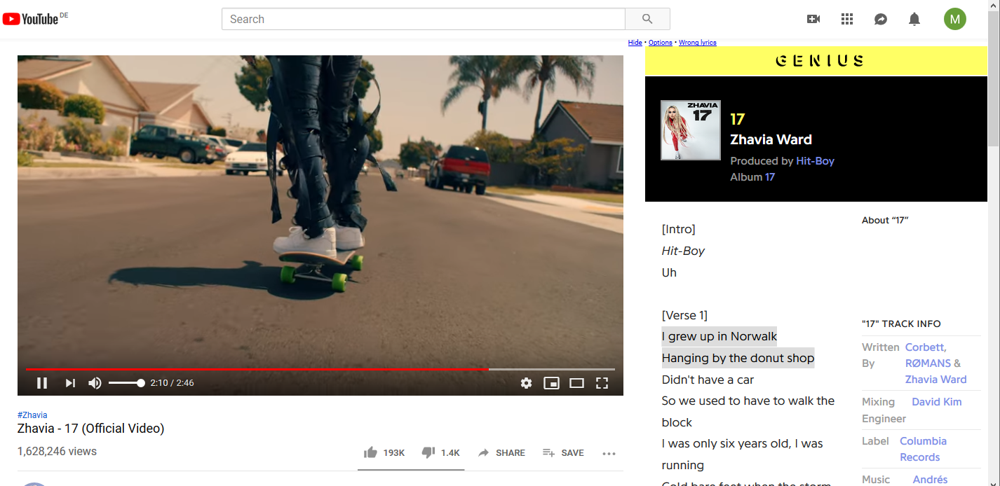

# Youtube-Genius-Lyrics-userscript
A userscript or greasemonkey script that shows lyrics from [genius.com](https://genius.com/) on [YouTube](https://www.youtube.com/) music videos

This is a userscript for your browser. It's primarily designed for Firefox and Chrome with
[Tampermonkey](https://www.tampermonkey.net/)  
or
[FireMonkey ](https://addons.mozilla.org/en-US/firefox/addon/firemonkey/).

General information about userscripts and how to use them can be found at [openuserjs.org/about/Userscript-Beginners-HOWTO](https://openuserjs.org/about/Userscript-Beginners-HOWTO).

[**Click here to install**](https://greasyfork.org/scripts/386259-youtube-genius-lyrics/code/Youtube%20Genius%20Lyrics.user.js)  
Tested with Firefox/**Tampermonkey** and Chrome/**Tampermonkey**.

### Navigation Links:
[Github - Youtube Genius Lyrics Userscript](https://github.com/cvzi/Youtube-Genius-Lyrics-userscript)
[Github - Genius Lyrics Userscript (Library)](https://github.com/cvzi/genius-lyrics-userscript/)
[Greasyfork - Youtube Genius Lyrics Userscript](https://greasyfork.org/en/scripts/386259-youtube-genius-lyrics)
[Greasyfork - Genius Lyrics Userscript (Library)](https://greasyfork.org/en/scripts/406698-geniuslyrics)

### Contributors:

### Similar scripts:
*   [Youtube Music Genius Lyrics](https://github.com/cvzi/Youtube-Music-Genius-Lyrics-userscript)
*   [Spotify Genius Lyrics](https://github.com/cvzi/Spotify-Genius-Lyrics-userscript)

### Screenshots:
- Default theme 
- Dark (Spotify) theme .png)

  
