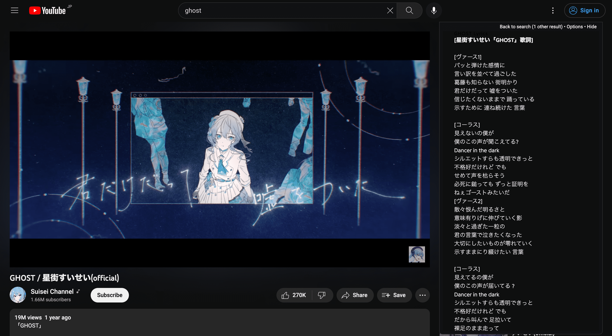
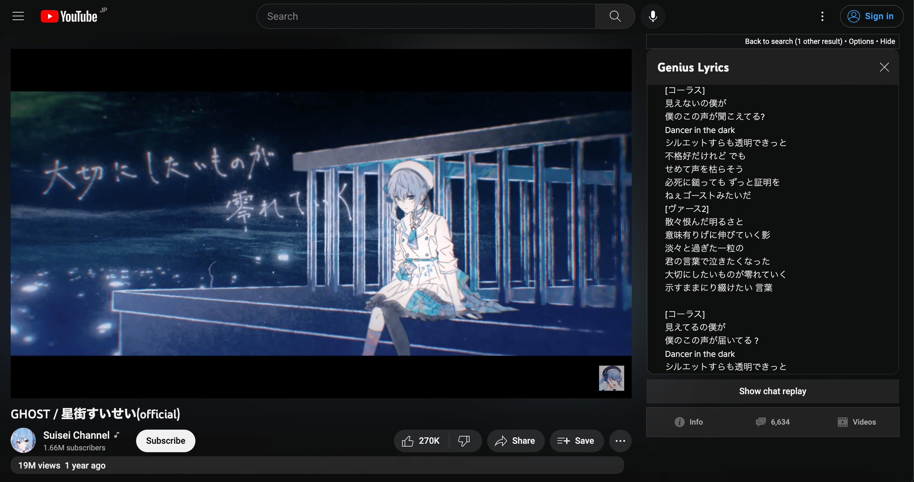

# Youtube-Genius-Lyrics-userscript
A userscript or greasemonkey script that shows lyrics from [genius.com](https://genius.com/) on [YouTube](https://www.youtube.com/) music videos

This is a userscript for your browser. It's primarily designed for Firefox and Chrome with
[Tampermonkey](https://www.tampermonkey.net/)  

General information about userscripts and how to use them can be found at [openuserjs.org/about/Userscript-Beginners-HOWTO](https://openuserjs.org/about/Userscript-Beginners-HOWTO).

[**Click here to install**](https://greasyfork.org/scripts/386259-youtube-genius-lyrics/code/Youtube%20Genius%20Lyrics.user.js)  
Tested with Firefox/**Tampermonkey** and Chrome/**Tampermonkey**.

Family of GeniusLyrics Userscripts:
*   Powered by **GeniusLyrics Library** [GitHub](https://github.com/cvzi/genius-lyrics-userscript/) [Greaskfork](https://greasyfork.org/en/scripts/406698-geniuslyrics)
*   **Spotify Genius Lyrics** [GitHub](https://github.com/cvzi/Spotify-Genius-Lyrics-userscript) [Greaskfork](https://greasyfork.org/en/scripts/377439-spotify-genius-lyrics)
*   **Youtube Genius Lyrics** [GitHub](https://github.com/cvzi/Youtube-Genius-Lyrics-userscript) [Greaskfork](https://greasyfork.org/en/scripts/386259-youtube-genius-lyrics)
*   **Youtube Music Genius Lyrics** [GitHub](https://github.com/cvzi/Youtube-Music-Genius-Lyrics-userscript/) [Greaskfork](https://greasyfork.org/en/scripts/406892-youtube-music-genius-lyrics)

### Contributors:

### Screenshots:
* 2022
-   Default theme (Dynamic Color with YouTube Dark & Light Themes) 
    * *Note: YouTube is now moving forwards into the dark mode (Darker Dark Mode with Cinematic Annotations)*
    * *Using Light Theme is highly non-recommended*
    
    
-   Integrated with [Tabview Youtube](https://greasyfork.org/en/scripts/428651-tabview-youtube) 
    * *Tabview Youtube*[(GitHub)](https://github.com/cyfung1031/Tabview-Youtube) is a userscript developed by [CY Fung](https://github.com/cyfung1031) to manage the page layout as tabs to maximize the watching experience.
    
* 2019 - 2021
-   Default theme 
    
-   Dark (Spotify) theme
    .png)

  
